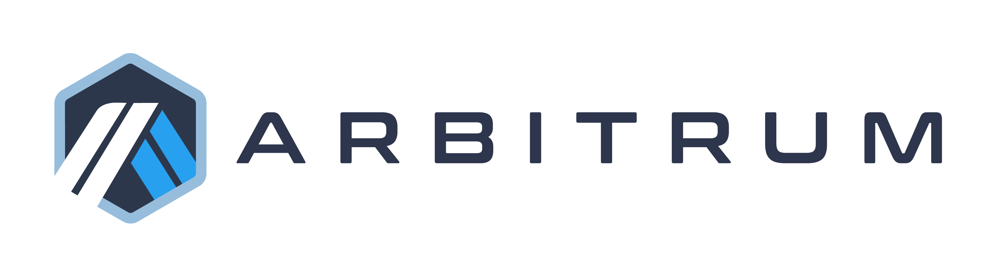

# Arbitrum Classic Monorepo

This repo represents the old "classic" Arbitrum tech stack; Arbitrum One was upgraded to use the Nitro tech in August of 2022. 

For the current Arbitrum Nitro codebase, see [Nitro](https://github.com/OffchainLabs/nitro).

- [Discord](https://discord.gg/ZpZuw7p)
- [Developer guide](https://developer.offchainlabs.com)

This repository is offered under the Apache 2.0 license. See LICENSE for details.
