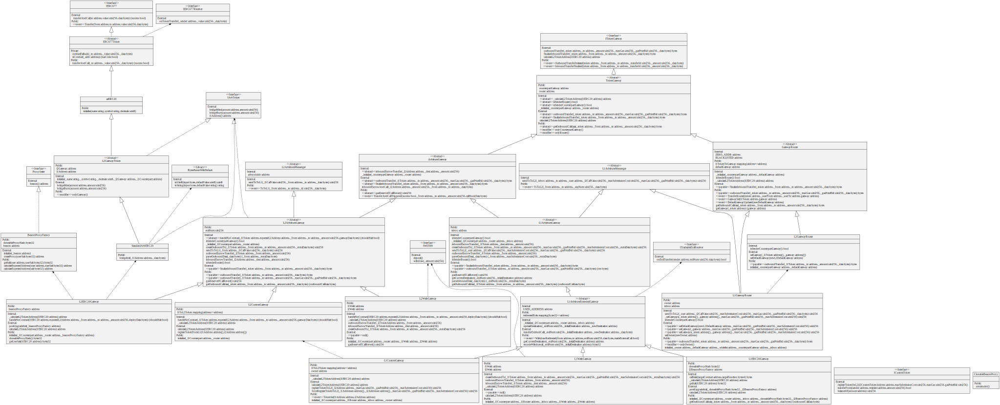
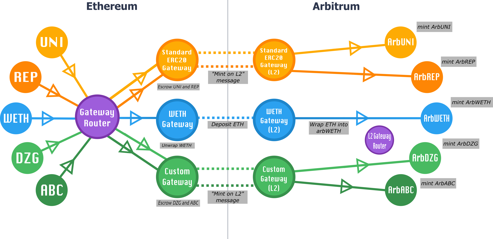
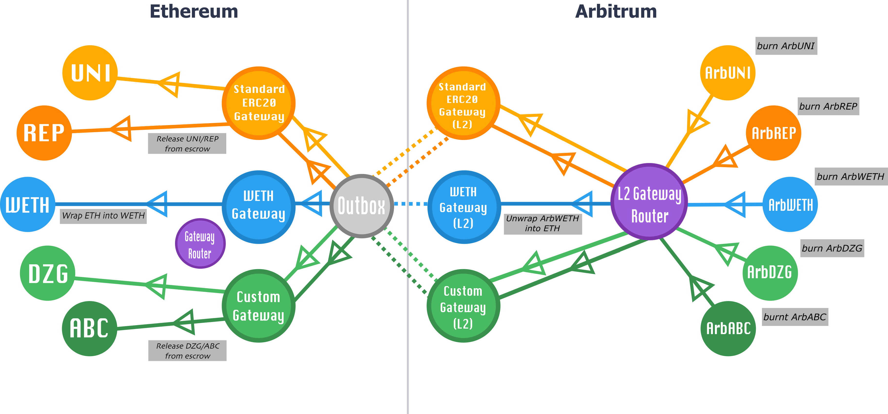

The Arbitrum protocol's ability to [pass messages between L1 and L2](L1_L2_Messages.md) can be leveraged to trustlessly move assets from Ethereum to an Arbitrum chain and back. Any asset / asset type can in principle be bridged, including Ether, ERC20 tokens, ERC-721 tokens, etc.

## Depositing And Withdrawing Ether

To move Ether from Ethereum onto the Arbitrum chain, you execute a deposit transaction via `Inbox.depositEth`. This transfers funds to the Bridge contract on the L1 and credits the same funds to you inside the Arbitrum chain at the specified address.

```sol
function depositEth(address destAddr) external payable override returns (uint256)
```

As far as Ethereum knows, all deposited funds are held by Arbitrum's Bridge contract.

Withdrawing ether can be done using the [ArbSys](Arbsys.md) withdrawEth method:

```sol
ArbSys(100).withdrawEth{ value: 2300000 }(destAddress)
```

Upon withdrawing, the Ether balance is burnt on the Arbitrum side, and will later be made available on the Ethereum side.

`ArbSys.withdrawEth` is actually a convenience function is which is equivalent to calling `ArbSys.sendTxToL1` with empty calldataForL1. Like any other `sendTxToL1` call, it will require an additional call to `Outbox.executeTransaction` on L1 after the dispute period elapses for the user to finalize claiming their funds on L1 (see ["L2 to L1 Messages Lifecycle && API"](L1_L2_Messages.md)). Once the withdrawal is executed from the Outbox, the user's Ether balance will be credited on L1.

## Bridging ERC20 Tokens

### Overview

The Arbitrum protocol itself technically has no native notion of any token standards, and gives no built-in advantage or special recognition to any particular token bridge. Described here is the "Canonical Bridge," which we at Offchain Labs implemented, and which should be the primary bridge most users and applications use; it is (effectively) a DApp with contracts on both Ethereum and Arbitrum that leverages Arbitrum's cross-chain message passing system to achieve basic desired token-bridging functionality. We recommend that you use it!

Currently, we maintain a whitelist of the tokens bridge-able through the canonical bridge; it will be removed soon. See [here](https://offchain.medium.com/continued-path-to-decentralization-bridging-tokens-into-arbitrum-42a94b054560) for more.

### Design Rationale

In our token bridge design, we use the term "Gateway" as per [this proposal](https://ethereum-magicians.org/t/outlining-a-standard-interface-for-cross-domain-erc20-transfers/6151); i.e., one of a pair of contracts on two different domains (i.e., Ethereum and an Arbitrum chain), used to facilitate cross-domain asset transfers.

Some core goals that motivated the design of our bridging system:

#### Custom Gateway functionality

For many ERC20 tokens, "standard" bridging functionality is sufficient, which entails the following: a token contract on Ethereum is associated with a "paired" token contract on Arbitrum. Depositing a token entails escrowing some amount of the token in an L1 bridge contract, and minting the same amount at the paired token contract on L2. On L2, the paired contract behaves much like a normal ERC20 token contract.

Withdrawing entails burning some amount of the token in the L2 contract, which then can later be claimed from the L1 bridge contract.

Many tokens, however, require custom Gateway systems, the possibilities of which are hard to generalize. E.g:

- Tokens which accrue interest to their holders need to ensure that the interest is dispersed properly across layers, and doesn't simply accrue to the bridge contracts
- Our cross-domain WETH implementations requires tokens be wrapped and unwrapped as they move across layers.

Thus, our bridge architecture must allow not just the standard deposit/withdraw functionality, but for new, custom Gateways to be dynamically added over time.

#### Canonical L2 Representation Per L1 Token Contract

...having multiple custom Gateways is well and good, but we also want to avoid a situation in which a single L1 token that uses our bridging system can be represented at multiple addresses/contracts on the L2 (as this adds significant friction and confusion for users and developers). Thus, we need a way to track which L1 token uses which gateway, and in turn, to have a canonical address oracle that maps the tokens addresses across the Ethereum and Arbitrum domains.

### Canonical Token Bridge Implementation

With this in mind, we provide an overview of our token bridging architecture:

Our architecture consists of three types of contracts:

1. **Asset contracts**: these are the token contracts themselves, i.e., an ERC20 on L1 and it's counterpart on Arbitrum.
2. **Gateways**: Pairs of contracts (one on L1, one on L2) that implement a particular type of cross chain asset bridging.
3. **Routers**: Exactly two contracts - (one on L1, one on L2) that route each asset to its designated Gateway.



All Ethereum to Arbitrum token transfers are initiated via the `L1GatewayRouter` contract. `L1GatewayRouter` forwards the token's deposit-call to it's appropriate `L1ArbitrumGateway` contract. `L1GatewayRouter` is responsible for mapping L1 token addresses to L1Gateway, thus acting as L1/L2 address oracle and ensuring that each token corresponds to only one gateway. The `L1ArbitrumGateway` communicates to an `L2ArbitrumGateway` (typically/expectedly via [retryable tickets](L1_L2_Messages.md)).

Similarly, Arbitrum to Ethereum transfers are initiated via the `L2GatewayRouter` contract, which forwards calls the token's `L2ArbitrumGateway`, which in turn communicates to its corresponding `L1ArbitrumGateway` (typically/expectedly via sending messages to the Outbox.)

For any given gateway pairing, we require that calls be initiated through the `GatewayRouter`, and that the gateways conform to the `TokenGateway` interfaces; the `TokenGateway` interfaces should be flexible and extensible enough to support any bridging functionality a particular token may require.

#### Standard Arb-ERC20 Bridging

To help illustrate what this looks like in practice, let's go through the steps of what depositing and withdrawing `SomeERC20Token` via our Standard ERC20 gateway looks like. Here, we're assuming that `SomeERC20Token` has already been registered in the `L1GatewayRouter` to use the Standard ERC20 Gateway.

#### Deposits

1. A user calls `GatewayRouter.outBoundTransfer` (with `SomeERC20Token`'s L1 address as an argument).
1. `GatewayRouter` looks up `SomeERC20Token`'s gateway, and finding that it's Standard ERC20 gateway (the `L1ERC20Gateway` contract).
1. `GatewayRouter` calls `L1ERC20Gateway.outBoundTransfer`, forwarding the appropriate parameters.
1. `L1ERC20Gateway` escrows tokens, and creates a retryable ticket to trigger `L2ERC20Gateway`'s `finalizeInboundTransfer` method on L2.
1. `finalizeInboundTransfer` mints the appropriate amount of tokens at the `arbSomeERC20Token` contract on L2.

Note that arbSomeERC20Token is an instance of StandardArbERC20, which includes `bridgeMint` and `bridgeBurn` methods only callable by the L2ERC20Gateway.



#### Withdrawals

1. On Arbitrum, a user calls `L2GatewayRouter.outBoundTransfer`, which in turn calls `outBoundTransfer` on arbSomeERC20Token's gateway (i.e., L2ERC20Gateway).
1. This burns arbSomeERC20Token tokens, and calls ArbSys with an encoded message to `L1ERC20Gateway.finalizeInboundTransfer`, which will be eventually executed on L1.
1. After the dispute window expires and the assertion with the user's transaction is confirmed, a user can call `Outbox.executeTransaction`, which in turn calls the encoded `L1ERC20Gateway.finalizeInboundTransfer` message, releasing the user's tokens from the L1ERC20Gateway contract's escrow.



### The Arbitrum Generic Custom Gateway

Just because a token has requirements beyond what are offered via the StandardERC20 gateway, that doesn't necessarily mean that a unique Gateway needs to be taylor-made for the token in question. Our Generic-Custom Gateway is designed to be flexible enough to be suitable for most (but not necessarily all) custom fungible token needs. As a general rule:

**If your custom token has the ability to increase its supply (i.e, mint) directly on the L2, and you want the L2-minted tokens be withdrawable back to L1 and recognized by the L1 contract, it will probably require its own special gateway. Otherwise, the Generic-Custom Gateway is likely the right solution for you!**

Some examples of token features suitable for the Generic-Custom Gateway:

- L2 token contract upgradable via a proxy
- L2 token contract includes address whitelisting /blacklisting
- Deployer determines address of L2 token contract

#### Setting Up Your Token With The Generic Custom Gateway

Follow the following steps to get your token set up to use the Generic Custom Gateway

**0. Have an L1 token**

- You token on L1 should conform to the [ICustomToken](./sol_contract_docs/md_docs/arb-bridge-peripherals/tokenbridge/libraries/gateway/ICustomGateway.md) interface; (see [TestCustomTokenL1](https://github.com/OffchainLabs/arbitrum/blob/master/packages/arb-bridge-peripherals/contracts/tokenbridge/test/TestCustomTokenL1.sol) for an example implementation). Crucially, it must have an `isArbitrumEnabled` method in its interface.

**1. Deploy your token on Arbitrum**

- Your token should conform to the minimum [IArbToken](./sol_contract_docs/md_docs/arb-bridge-peripherals/tokenbridge/arbitrum/IArbToken.md)
  interface; i.e., it should have `bridgeMint` and `bridgeBurn` methods only callable by the L2CustomGateway contract, and the address of its corresponding Ethereum token accessible via `l1Address`. For an example implementation, see [TestArbCustomToken](https://github.com/OffchainLabs/arbitrum/blob/master/packages/arb-bridge-peripherals/contracts/tokenbridge/test/TestArbCustomToken.sol).

**2. Register Your Token on L1 to Your Token on L2 via the L1CustomGateway Contract**
Have your L1 token's contract make an external call to `L1CustomGateway.registerTokenToL2`. This registration can alternatively be performed as an admin registration.

**3. Register Your Token on L1 To the L1Gateway Router**
After your token's registration to the Custom Gateway is complete, have your L1 token's contract make an external call to `L1GatewayRouter.setGateway`; this registration can also alternatively be performed as an admin registration.

| ☝️ The admin privilege over the router and generic custom gateway are temporary and users should use at their own discretion |
| ---------------------------------------------------------------------------------------------------------------------------- |

#### Other Flavors of Gateways

Note that in the system described above, one pair of Gateway contracts handles the bridging of many ERC20s; i.e., many ERC20s on L1 are each paired with their own ERC20s on Arbitrum via a single gateway contract pairing. Other gateways may well bear different relations with the contracts that they bridge.

Take our wrapped Ether implementation, for example: here, a single WETH contract on L1 is connected to a single WETH contract on L2. When transferring WETH from one domain to another, the L1/L2 Gateway architecture is used to unwrap the WETH on domain A, transfer the now-unwrapped Ether, and then re-wrap it on domain B. This ensures that WETH can behave on Arbitrum the way users are used to it behaving on Ethereum, while ensuring that all WETH tokens are always fully collateralized on the layer in which they reside.

No matter the complexity of a particular token's bridging needs, a gateway can in principle be created it to accommodate it within our canonical bridging system.

### Demos

See [token-deposit](https://github.com/OffchainLabs/arbitrum-tutorials/tree/master/packages/token-deposit) and [token-withdraw](https://github.com/OffchainLabs/arbitrum-tutorials/tree/master/packages/token-withdraw) for demos of interacting with the bridge architecture via [arb-ts](https://arb-ts-docs.netlify.app/).

#### A Word of Caution on Bridges (aka, "I've Got a Bridge To Sell You")

Cross chain bridging is an exciting design space; alternative bridge designs can potentially offer faster withdrawals, interoperability with other chains, different trust assumptions with their own potentially valuable UX tradeoffs, etc. They can also potentially be completely insecure and/or outright scams. Users should treat other, non-canonical bridge applications the same way they treat any application running on Arbitrum, and exercise caution and due diligence before entrusting them with their value.
