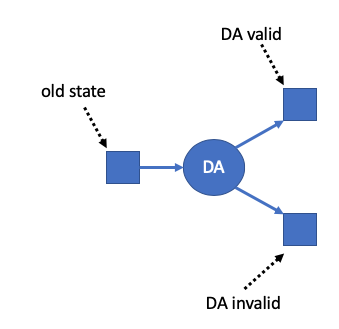
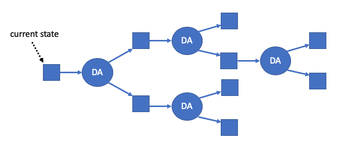
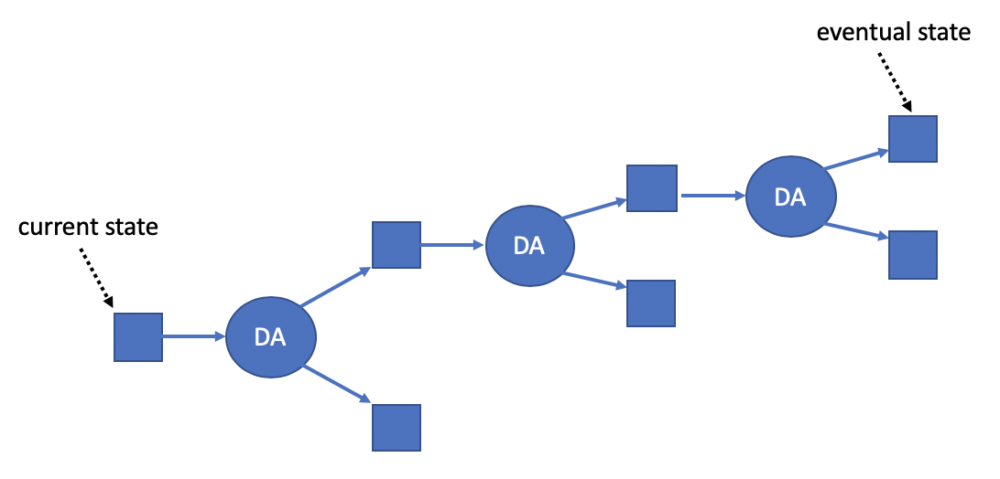
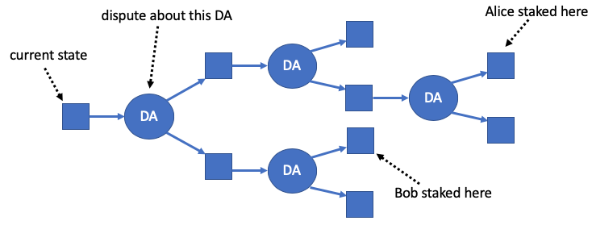
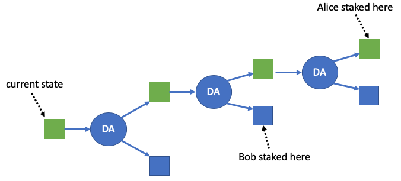

# Arbitrum Rollup Protocol Design

Arbitrum Rollup is an off-chain protocol that is managed by an on-chain Ethereum contract. A dApp developer has a contract or set of contracts written in Solidity, and the developer wants to deploy those contracts onto a Layer 2 Arbitrum Rollup chain (ArbChain).

This document describes the design conceptually, and then somewhat more formally. Finally, we prove that the protocol guarantees safety and eventual progress, assuming one honest staker.

## Basics of Rollup

Let’s start with the basics. The state of your VM is organized as a Merkle Tree, so a cryptographic hash of the VM’s state can be computed. At any point in the protocol, there is some state of the VM that is fully confirmed and final. Its hash is stored on-chain.

A participant in the protocol can make a _Disputable Assertion_ (DA) which claims that starting in some state-hash, and with some technical preconditions, the VM can execute a specified number of steps of computation, resulting in a specified new state-hash, and with the VM making specified payments and emitting specified log events during that computation. The DA might be valid (i.e., truthful) or invalid. The party making the DA will be required to stake a deposit on the validity of the DA. (More on stakes and how they work below.)

As depicted above, a Disputable Assertion creates a logical decision point that the protocol will eventually have to resolve. If the DA is valid, the system will enter a new state on the upper right, with a new state hash, and with the side-effects (payments and logs) specified in the DA. Or on the other branch the DA is invalid; it is rejected and the VM's state is unchanged.

### The Arbitrum 2.0 protocol

The current Arbitrum protocol makes important advances over the original Arbitrum protocol in that it supports multiple pipelined DAs In the new protocol, each state can have at most one DA following from it. If a DA has no following state, then anybody can create a DA that follows it, creating a new branch point. The result will be a tree of possible futures, like the one shown below.

### Staking

Another important part of the protocol is staking. Anybody can put a stake on one of the square boxes in the tree. By staking on a square you are asserting that that square will eventually be confirmed by the protocol. In other words, you’re asserting that you have taken the correct branch at each DA along the path from the current state to the square you’re staked on. If you are wrong, you can expect to lose your stake.

Staking actions cannot be undone. You can move your stake to the right — choosing to go up or down at each branch point — but you can’t move to the left because that would amount to undoing a staking commitment that you made earlier.

The party who makes a Disputable Assertion is required to stake on the “DA valid” successor of that DA. Normally they’ll be able to satisfy this requirement by moving an existing stake to the right to put it onto the required successor square. If they haven't already put down a stake, they'll have to provide one.

One more detail about stakes: if the square you are staked on is confirmed and becomes the accepted history, you have the option of recovering your stake. That means that if you are correct, you can keep your stake where it is and wait for the system to “catch up” with you, and then you’ll be able to recover your stake.

At this point you might be worried that the tree of possibilities can get very large and branch-y. That’s not likely to happen in practice, because it would require multiple parties to stake on outcomes that are mutually inconsistent. Only one of them can be correct, and everybody else will lose their stake. More likely is that the “tree” is really a chain of valid DAs, one after another, and all of the stakes are on the same outcomes. The diagram below shows this typical situation: basically a set of "pipelined" DAs that will probably all be accepted eventually.

### Staking Deadlines

We need the system to make a decision about each Disputable Assertion before too much time passes. So when a DA is added to the chain, creating a branch point, a deadline is associated with that DA. The deadline is far enough in the future that everyone will have time to check whether the DA is valid and get a transaction on-chain to stake on an outcome of the DA, if they choose to do so. If anyone wants to commit themselves to a stake for or against the validity of that DA, they must do so before the deadline. (Stakes can still be introduced after the deadline, but they do not participate in deciding for or against that DA.) Once the deadline has been reached, all of the stakes relevant to deciding that DA will be known.

### Disputes

If Alice and Bob are staked on different squares, one of two things will be true. Either there will be a rightward-moving path from one of them to the other — meaning their claims are consistent with each other — or there will not be such a path. If there is not a rightward-moving path connecting Alice and Bob’s squares, then they must disagree about something. There will always be a unique point of dispute between them — a unique DA for which one of them is staked on that DA being valid and the other is staked on it being invalid.

Whenever there is a dispute between two parties, the system can start an interactive dispute resolution protocol between them. The dispute resolution protocol is described [elsewhere](Dispute_Resolution.md) — here it is enough to say that it is a bisection-type interactive protocol similar to what we have described in other Arbitrum documents. The dispute protocol requires the parties to take turns making moves, with a deadline for each move. A party who fails to act by the deadline will forfeit the challenge.

The result of the dispute resolution protocol is that one party will be found to be incorrect. That party will forfeit their stake. The stake will be erased from the square it is on. Part of it will be given to the other party in the dispute, and the rest will be burned.

Dispute resolution determines that one of the two disputant parties was incorrect, but we cannot infer that the other party was necessarily correct. Perhaps both parties made errors, or perhaps the two parties were colluding to "cook" the result of the dispute. Because of these possibilities, at the end of a dispute all that happens is that the loser has their stake removed. (Half of the loser's stake goes to the winner of the dispute, and the other half is burned.)

Multiple disputes can be going on at the same time, but each staker can be in at most one dispute at a time. Because losers’ stakes will be removed, each dispute will reduce the amount of disagreement in the system. Parties who lose their stakes can re-stake if they want, but the new stakes won’t be able to affect DAs whose staking deadlines have already passed. The effect of this is that after a DA’s staking deadline has passed, disputes will progressively eliminate any disagreement about how to treat that DA.

### Confirming Results

Once a DA’s staking deadline has passed, and all of the timely (placed before the staking deadline) stakes that remain are on the same (upper or lower) branch from that DA, the system can confirm the result of that DA. The DA is either accepted or rejected, and the current state moves to the appropriate square to the right of the DA. If the DA is confirmed as valid, its side-effects, such as payments, are effectuated on-chain. This is how the state of the VM moves forward.

In the common case, parties will behave honestly, because they won’t want to lose their stakes by staking on false claims. Only valid DAs will be asserted, in a single chain, and nobody will stake on the invalid branch of any DA. In this case, every DA can be confirmed immediately when its staking deadline expires.

### Why It’s Trustless

An important property of Arbitrum Rollup is that it’s trustless — a single honest party can force the VM to behave correctly and make progress. To see why, imagine that Alice always stakes on the truthful branch at each DA, and she asserts DAs if the tree ever gets empty. If anybody else makes a false DA, Alice stakes against it.

Because Alice is staked on true branches, she will win every dispute she gets into. If anybody else disagrees with Alice, they will either (a) lose their stake in an unrelated dispute with a third party, or (b) eventually get into a dispute with Alice and lose their stake to her. Either way, everyone who disagrees with Alice will eventually lose their stake. Only stakes that agree with Alice will survive, so Alice’s path through the tree will eventually be the only one that has timely stakes on it — and Alice’s path will be confirmed.

Because the system is trustless in this way, if Alice is staked on a square and she knows the path to that square is truthful, Alice can be certain that the square she is on will eventually be confirmed. As far as Alice is concerned, that path is as good as final.

Even if you’re not staked on a path, if you see that several people are staked on it, and you trust that at least one of those people is honest, then you can be sure that that path will be confirmed eventually — as far as you are concerned, that path is as good as final.

### Benefits of trustless finality

Why is it valuable to have trustless finality for outcomes? The classic example comes from previous discussions of other rollup protocols. Suppose a VM is going to make a payment to Alice. The payment event is on the honest path, but it’s going to be a while before the square where the payment happens will be confirmed on-chain.

Trustless finality gives Alice a way to get her money right away. If Bob has unencumbered money, he can give it to Alice immediately, in exchange for Alice assigning the future not-yet-confirmed payment to Bob (plus paying Bob a minimal fee). Bob will only want to do that if he can be sure that the payment will actually happen. Bob can make sure of that by staking on the honest outcome — then he will have trustless confidence that the payment will eventually happen. It’s not only Bob who can do that. Anybody who has funds can lend them to Alice and others like her, in the same way. Those people can compete with each other by offering lower fees, driving down Alice’s cost to get her funds right away.

The key point is that the viability of this kind of market mechanism depends on trustless finality. The delay in on-chain confirmation of a thing is less of an inconvenience if “everybody” already knows that that thing will eventually be confirmed.

This is true not only for payments but for other things a VM does. If the VM is going to emit a log item announcing that something has happened, trustless finality means that anyone can act with certainty that the log item will be recognized on-chain.

### Delay attacks

Because the system is trustless, bad actors can’t force an incorrect outcome. What they can try to do is slow down progress. Doing this requires them to sacrifice stakes, which will be costly if the stake amount is significant.

Let’s imagine that somebody is motivated to launch delay attacks, and they’re willing to sacrifice stakes. What is the worst damage they can do?

The first thing to note is that bad actors can’t prevent honest parties from continuing to build out the honest branch of the tree. And they can’t prevent honest parties from gaining trustless confidence in the eventual confirmation of the honest branch.

All that an attacker can do is to stake on false branches to delay on-chain confirmation of the honest path. Each stake they place will create one more dispute against an honest party, in which the honest party takes a big chunk of the attacker’s stake. Once all of the attacker’s stakes have been taken, on-chain progress will continue.

What if the attacker places multiple stakes on false outcomes? Then those stakes will have to be taken one by one in disputes. If there are multiple people staked on the honest outcome, those people can all enter disputes against the attackers, working in parallel to take the attacker stakes. And notice that it will be obvious to everyone what is happening, and lots of people will want to get in on the action, staking on the true outcome so they can join the feeding frenzy of people using disputes to grab attacker stakes. If there are _K_ people staking on the honest side, it will cost the attacker _K_ stakes to buy one dispute period of delay. If the attacker puts down even more stakes, that will likely attract even more honest stakers. That’s a bad dynamic for the attacker.

### Optimizations

Various optimizations are possible to reduce the amount of on-chain bookkeeping that is necessary to operate the protocol, to reduce the on-chain gas cost, and to make beneficial feeding frenzies against delay attackers easier to mount. The purpose of this document is to give a general and accessible overview into the Rollup protocol, and as such we won’t drill down into the optimizations here. But if you’re worried about the cost of implementing this, we can assure you that the EthBridge’s cost to monitor all of this will be less than you expect. For details, you can consult the [Arbitrum Rollup code](https://github.com/offchainlabs/arbitrum).

## More Formal Description of the Protocol

We now describe the protocol in a somewhat more formal way.

### Assertions and subassertions

First, we note that in practice the tree of futures is not binary but 4-ary. This is because each assertion actually consists of three sub-assertions: the inbox-top subassertion, the messages subassertion, and the execution subassertion. So each DA induces four successor nodes: (0) all subassertions are right, (1) inbox-top is wrong, (2) inbox-top is right but messages are wrong, (3) inbox-top and messages are right but execution is wrong. At each point in the tree, a staker must take a position on which of these four possibilities it is endorsing.

### State of the protocol

Logically, the protocol's state consists of:

- a LatestConfirmed node: a node of the rollup treee which is the latest node that has been fully confirmed and executed on the L1 chain;
- a tree of nodes rooted at LatestConfirmed, and the DAs that induce that tree, including the deadlines of those DAs;
- a set of stakers, and on which node of the tree each staker is staked; and
- a set of challenges currently in progress.

### Challenges

Each staker can be in at most one challenge at a time. At any time, anyone can start a challenge by pointing to a DA and two stakers such that (a) neither staker is currently in a challenge, and (b) both stakers are staked directly or indirectly on different children of the DA, and (c) both stakers initially created their stake before the DA's deadline. (A challenge between can start either before or after the relevant DA's deadline, as long as the three conditions listed above are met.)

Once a challenge has been started, the challenge protocol will eventually declare one of the two stakers the loser of the challenge. The loser will lose their stake, and will no longer be a staker. (The loser is free to place another stake later.)

### Creating stakes

Any party who is not already a staker can deposit a stake on any node of the tree at any time. The system records when a staker's stake was initially introduced, and the staker is "deemed not to have taken a position" on any DA whose deadline is before the staker placed its stake.

### Moving stakes

Any staker can "move its stake to the right" by moving the stake to any node in the tree that is a descendant of the current location of that stake.

### Recovering a stake

If a staker is staked on the LatestConfirmed node, or any node that is at a lower "height" in the node tree than the LatestConfirmed node, the staker can recover its stake. The stake is returned to the staker and that party is no longer a staker.

In the current implementation, there are several conditions for recovering a stake, which together cover all of the ways a stake could become older than LatestConfirmed, or otherwise mooted. In the implementation, a stake can be recovered if: the stake is at LatestConfirmed or a predecessor of it, or if the stake is at a node that is not LatestConfirmed and is neither a predecessor nor a successor of LatestConfirmed. (Such a stake is "moot" or irrelevant. It cannot participate in challenges, nor can it affect which node gets Confirmed. So a rational staker will let such a stake sit idle until it is older than Latest Confirmed, then recover it. The current implementation allows such a stake to be recovered immediately.)

In addition, the current implementation allows any party to forcibly refund a stake if that stake is at a node that has a successor whose deadline has passed. This is designed to incent stakers to keep their stake moving forward. A staker can never get into this situation if it moves its stake to the frontier of the tree at least once per challenge period.

### Making assertions and growing the tree

A staker who is staked on a leaf node of the tree can make a new Disputable Assertion, from that leaf node's state. This grows the tree by creating four new nodes as children of that previous leaf node. The asserting staker's stake is moved to the child that corresponds to the new DA being fully correct.

### Confirming a node

Unless the LatestConfirmed node is a leaf of the tree, there is some DA which was asserted from the LatestConfirmed node. If the deadline for that DA has passed, and if all stakers who introduced their stake before the DA's deadline are staked on the same child of that node (or a descendant of it) (and if there is at least one such staker), then the child node can be confirmed. It becomes the new LatestConfirmed node.

If the newly confirmed child corresponds to the DA having been correct, then all of the side-effects of the DA are executed on the L1 chain: payments are made and log items are emitted.

### Pruning the tree

A subtree can be pruned from the tree if two things are true: (a) at the root of the subtree is a node whose deadline has passed, and (b) there are no stakes in the subtree that were initiated before the root's deadline. Such a subtree is essentially moot because there cannot be a dispute about whether the subtree can be entered. When a subtree is pruned, anyone staked in it will have their stake refunded.

The only exception to this rule is that the LatestConfirmed node cannot be pruned.

### Optimizing the implementation

The EthBridge needs to enforce the rules of this protocol. To save storage, the EthBridge does not store the entire tree, but instead stores the Merkle hashes of the leaves (which hash-chain-include the Merkle hashes of internal nodes of the tree), as well as information about the LatestConfirmed node, each staker, and any ongoing challenges.

The state changes described above can be initiated by any party, who can make a txcall to the EthBridge to force a state change. The caller submits any necessary Merkle proofs to allow the EthBridge to confirm nodes. (Actions to control a stake must of course be initiated by that staker.)

## Correctness of the protocol

### Proof of safety, assuming one honest staker

Assume there is one honest staker, whose stake was initiated before the deadline of the LatestConfirmed node (and therefore necessarily before the deadline of any successor of the LatestConfirmed node).

Each node will have exactly one valid successor, because the validity conditions for the four children of a node are defined so that exactly one of them must be true. It follows that there will be exactly one valid leaf node of the tree.

The honest staker can force safety by always staking on the valid leaf node. The honest staker will be able to win all challenges, so its stake will always remain. And as long as this stake remains, no invalid child of LatestConfirmed can be confirmed, because the presence of the honest staker's stake on a different branch will falsify one of the required conditions for confirmation.

It follows that the honest staker can prevent acceptance of invalid nodes.

### Proof of eventual progress, assuming one honest staker

Under the same assumptions as the previous proof, we now show that an honest staker can force the eventual acceptance of some valid DA.

First, we show that a valid DA will eventually be added to the valid path from LatestConfirmed. This is true because the honest staker can create a valid DA on the valid path, if one does not already exist.

Now it suffices to show that the honest staker can ensure that the LatestConfirmed node will eventually advance. This is true because the LatestConfirmed node has a deadline which will eventually pass. Once the deadline has passed, there will be a finite number of stakers who are staked on different branches than the honest staker (i.e., incorrect branches). The number of such incorrect stakers can no longer increase because the deadline has passed. The honest staker can originate challenges with these incorrect stakers, one by one. The honest staker, being staked on the valid branch, will be able to win these challenges, thereby eliminating the incorrect stakers one by one.

Once all incorrect stakers have been eliminated, the honest staker can cause a new node to be confirmed. Therefore new nodes will eventually be confirmed.

### Disincentive to stake on incorrect branches

Assume there is at least one staker who rationally maximizes their income, every other staker has a disincentive to stake on incorrect branches.

If a staker stakes on an incorrect branch, the rational staker can respond by staking on the correct branch and initiating a challenge with the incorrect staker. The rational staker will be able to win the challenge and take the incorrect staker's stake.

Note that an incorrect staker cannot save their stake by arranging to be in a dispute against a confederate. Because the dispute's winner gets only half of the loser's stake, and the other half is burned, a colluding pair of disputants will lose half of a stake in total, which creates a disincentive to engage in bogus disputes.

### Eventual recoverability of honest stakers' stakes

An honest staker will always be able to recover their stake. An honest staker will never lose a challenge, so once its stake is placed, and wherever the stake is moved, the stake will remain "on the board".

And if the honest staker stops moving its stake, the LatestConfirmed node will eventually catch up to, and move beyond, the height of the honest staker's stake. (If there is no activity on the chain, the staker can post null assertions to ensure that the depth of LatestConfirmed eventually advances past the stake.) At that point the staker will be able to recover its stake.
